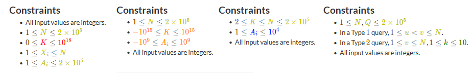

# AtCoder Limit Colorizer

A userscript that colors the constraints based on their limits.


## Colors

- $N = 998244353, 1000000007$: Special (`#0dcaf0`, from the "Unknown" difficulty of AtCoder Problems)
- $N \leq 10**18$: Red
- $N \leq 10**9$: Orange
- $N \leq 10**5$: Yellow
- $N \leq 1000$: Blue
- $N \leq 100$: Cyan
- $N \leq 10$: Green
- Otherwise: Brown


## Installation

1. Install a userscript manager like [Tampermonkey](https://www.tampermonkey.net/).
2. Click [here](https://raw.githubusercontent.com/sevenc-nanashi/atcoder-limit-colorizer/built/index.user.js) to install the script.

## Development

To install dependencies:

```bash
bun install
```

To run:

```bash
bun run dev
```

## License

This project is licensed under the MIT License - see the [LICENSE](./LICENSE) file for details.
